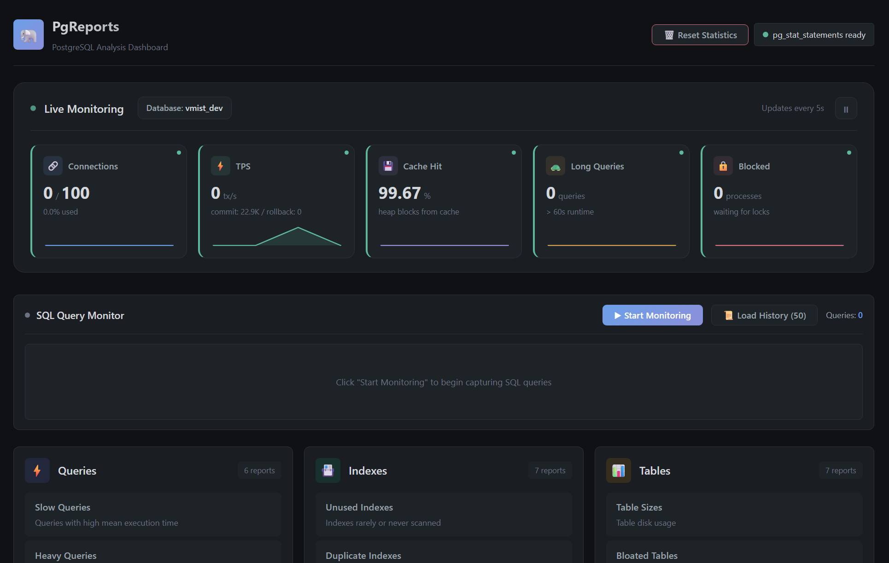

# PgReports

[](https://rubygems.org/gems/pg_reports)
[](https://www.ruby-lang.org/)
[](https://rubyonrails.org/)
[](https://opensource.org/licenses/MIT)

A comprehensive PostgreSQL monitoring and analysis library for Rails applications. Get insights into query performance, index usage, table statistics, connection health, and more. Includes a beautiful web dashboard and Telegram integration for notifications.



## Features

- 📊 **Query Analysis** - Identify slow, heavy, and expensive queries using `pg_stat_statements`
- 📇 **Index Analysis** - Find unused, duplicate, invalid, and missing indexes
- 📋 **Table Statistics** - Monitor table sizes, bloat, vacuum needs, and cache hit ratios
- 🔌 **Connection Monitoring** - Track active connections, locks, and blocking queries
- 🖥️ **System Overview** - Database sizes, PostgreSQL settings, installed extensions
- 🌐 **Web Dashboard** - Beautiful dark-themed UI with sortable tables and expandable rows
- 📨 **Telegram Integration** - Send reports directly to Telegram
- 📥 **Export** - Download reports in TXT, CSV, or JSON format
- 🔗 **IDE Integration** - Open source locations in VS Code, Cursor, RubyMine, or IntelliJ (with WSL support)
- 📌 **Comparison Mode** - Save records to compare before/after optimization
- 📊 **EXPLAIN ANALYZE** - Advanced query plan analyzer with problem detection and recommendations
- 🔍 **SQL Query Monitoring** - Real-time monitoring of all executed SQL queries with source location tracking
- 🔌 **Connection Pool Analytics** - Monitor pool usage, wait times, saturation warnings, and connection churn
- 🗑️ **Migration Generator** - Generate Rails migrations to drop unused indexes

## Installation

Add to your Gemfile:

```ruby
gem "pg_reports"

# Optional: for Telegram support
gem "telegram-bot-ruby"
```

Run:

```bash
bundle install
```

## Quick Start

### Mount the Dashboard

Add to your `config/routes.rb`:

```ruby
Rails.application.routes.draw do
  # Mount in development only (recommended)
  if Rails.env.development?
    mount PgReports::Engine, at: "/pg_reports"
  end

  # Or with authentication
  authenticate :user, ->(u) { u.admin? } do
    mount PgReports::Engine, at: "/pg_reports"
  end
end
```

Visit `http://localhost:3000/pg_reports` to access the dashboard.

### Use in Console or Code

```ruby
# Get slow queries
PgReports.slow_queries.display

# Get unused indexes
report = PgReports.unused_indexes
report.each { |row| puts row["index_name"] }

# Export to different formats
report.to_text   # Plain text
report.to_csv    # CSV
report.to_a      # Array of hashes

# Send to Telegram
PgReports.expensive_queries.send_to_telegram

# Health report
PgReports.health_report.display
```

## Configuration

Create an initializer `config/initializers/pg_reports.rb`:

```ruby
PgReports.configure do |config|
  # Telegram (optional)
  config.telegram_bot_token = ENV["PG_REPORTS_TELEGRAM_TOKEN"]
  config.telegram_chat_id = ENV["PG_REPORTS_TELEGRAM_CHAT_ID"]

  # Query thresholds
  config.slow_query_threshold_ms = 100        # Queries slower than this
  config.heavy_query_threshold_calls = 1000   # Queries with more calls
  config.expensive_query_threshold_ms = 10000 # Total time threshold

  # Index thresholds
  config.unused_index_threshold_scans = 50    # Index with fewer scans

  # Table thresholds
  config.bloat_threshold_percent = 20         # Tables with more bloat
  config.dead_rows_threshold = 10000          # Dead rows needing vacuum

  # Output settings
  config.max_query_length = 200               # Truncate queries in text output

  # Dashboard authentication (optional)
  config.dashboard_auth = -> { 
    authenticate_or_request_with_http_basic do |user, pass|
      user == "admin" && pass == "secret"
    end
  }

  # External fonts (Google Fonts)
  # Default: false (no external requests)
  config.load_external_fonts = ENV["PG_REPORTS_LOAD_EXTERNAL_FONTS"] == "true"
  # or simply:
  # config.load_external_fonts = true

end
```

### Query Execution Security

⚠️ **Security Warning**: By default, the dashboard **does not allow** executing raw SQL queries via "Execute Query" and "EXPLAIN ANALYZE" buttons. This prevents accidental or malicious query execution in production environments.

To enable query execution (only in secure environments):

```ruby
PgReports.configure do |config|
  # Enable query execution from dashboard (default: false)
  config.allow_raw_query_execution = true
end
```

Or via environment variable:

```bash
export PG_REPORTS_ALLOW_RAW_QUERY_EXECUTION=true
```

**Recommended setup** (only enable in development/staging):

```ruby
# config/initializers/pg_reports.rb
PgReports.configure do |config|
  # Only allow query execution in development/staging
  config.allow_raw_query_execution = Rails.env.development? || Rails.env.staging?

  # Combine with authentication for additional security
  config.dashboard_auth = -> {
    authenticate_or_request_with_http_basic do |user, pass|
      user == ENV["PG_REPORTS_USER"] && pass == ENV["PG_REPORTS_PASSWORD"]
    end
  }
end
```

When disabled:
- API endpoints `/execute_query` and `/explain_analyze` return 403 Forbidden
- UI buttons are disabled with explanation tooltips
- Existing safety measures (SELECT/SHOW only, automatic LIMIT) still apply when enabled

## Query Source Tracking

PgReports automatically parses query annotations to show **where queries originated**. Works with:

### Marginalia (recommended)

If you use [marginalia](https://github.com/basecamp/marginalia), PgReports will automatically parse and display controller/action info in the **source** column.

```ruby
# Gemfile
gem 'marginalia'
```

### Rails 7+ Query Logs

```ruby
# config/application.rb
config.active_record.query_log_tags_enabled = true
config.active_record.query_log_tags = [:controller, :action]
```

## Available Reports

### Queries (requires pg_stat_statements)

| Method | Description |
|--------|-------------|
| `slow_queries` | Queries with high mean execution time |
| `heavy_queries` | Most frequently called queries |
| `expensive_queries` | Queries consuming most total time |
| `missing_index_queries` | Queries potentially missing indexes |
| `low_cache_hit_queries` | Queries with poor cache utilization |
| `all_queries` | All query statistics |
| `reset_statistics!` | Reset pg_stat_statements data |

### Indexes

| Method | Description |
|--------|-------------|
| `unused_indexes` | Indexes rarely or never scanned |
| `duplicate_indexes` | Redundant indexes |
| `invalid_indexes` | Indexes that failed to build |
| `missing_indexes` | Tables potentially missing indexes |
| `index_usage` | Index scan statistics |
| `bloated_indexes` | Indexes with high bloat |
| `index_sizes` | Index disk usage |

### Tables

| Method | Description |
|--------|-------------|
| `table_sizes` | Table disk usage |
| `bloated_tables` | Tables with high dead tuple ratio |
| `vacuum_needed` | Tables needing vacuum |
| `row_counts` | Table row counts |
| `cache_hit_ratios` | Table cache statistics |
| `seq_scans` | Tables with high sequential scans |
| `recently_modified` | Tables with recent activity |

### Connections

| Method | Description |
|--------|-------------|
| `active_connections` | Current database connections |
| `connection_stats` | Connection statistics by state |
| `long_running_queries` | Queries running for extended period |
| `blocking_queries` | Queries blocking others |
| `locks` | Current database locks |
| `idle_connections` | Idle connections |
| `pool_usage` | 🆕 Connection pool utilization analysis |
| `pool_wait_times` | 🆕 Resource wait time analysis |
| `pool_saturation` | 🆕 Pool health warnings with recommendations |
| `connection_churn` | 🆕 Connection lifecycle and churn rate analysis |
| `kill_connection(pid)` | Terminate a backend process |
| `cancel_query(pid)` | Cancel a running query |

### System

| Method | Description |
|--------|-------------|
| `database_sizes` | Size of all databases |
| `settings` | PostgreSQL configuration |
| `extensions` | Installed extensions |
| `activity_overview` | Current activity summary |
| `cache_stats` | Database cache statistics |
| `pg_stat_statements_available?` | Check if extension is ready |
| `enable_pg_stat_statements!` | Create the extension |

## pg_stat_statements Setup

For query analysis, you need to enable `pg_stat_statements`:

1. Edit `postgresql.conf`:
   ```
   shared_preload_libraries = 'pg_stat_statements'
   pg_stat_statements.track = all
   ```

2. Restart PostgreSQL:
   ```bash
   sudo systemctl restart postgresql
   ```

3. Create extension (via dashboard or console):
   ```ruby
   PgReports.enable_pg_stat_statements!
   ```

> **Note**: PgReports does **not** require the `pg_read_all_settings` role. It detects `pg_stat_statements` availability by directly querying the extension, making it compatible with CloudnativePG, managed databases, and other environments with restricted permissions.

## Report Object

Every method returns a `PgReports::Report` object:

```ruby
report = PgReports.slow_queries

report.title         # "Slow Queries (mean time >= 100ms)"
report.data          # Array of hashes
report.columns       # Column names
report.size          # Row count
report.empty?        # Boolean
report.generated_at  # Timestamp

# Output formats
report.to_text       # Plain text table
report.to_markdown   # Markdown table
report.to_html       # HTML table
report.to_csv        # CSV
report.to_a          # Raw data

# Actions
report.display                  # Print to STDOUT
report.send_to_telegram         # Send as message
report.send_to_telegram_as_file # Send as file attachment

# Enumerable
report.each { |row| puts row }
report.map { |row| row["query"] }
report.select { |row| row["calls"] > 100 }
```

## Web Dashboard

The dashboard provides:

- 📊 Overview of all report categories with descriptions
- ⚡ One-click report execution
- 🔍 Filter parameters - adjust thresholds and limits on the fly
- 🔍 Expandable rows for full query text
- 📋 Copy query to clipboard
- 📥 Download in multiple formats (TXT, CSV, JSON)
- 📨 Send to Telegram
- 🔧 pg_stat_statements management
- 🔄 Sortable columns - click headers to sort ascending/descending
- 📌 Save records for comparison - track before/after optimization results
- 📊 EXPLAIN ANALYZE - run query plans directly from the dashboard
- 🗑️ Migration generator - create Rails migrations to drop unused indexes
- 🔗 IDE integration - click source locations to open in your IDE

### IDE Integration

Click on source locations in reports to open the file directly in your IDE. Supported IDEs:

- **VS Code (WSL)** - for Windows Subsystem for Linux
- **VS Code** - direct path for native Linux/macOS
- **RubyMine**
- **IntelliJ IDEA**
- **Cursor (WSL)** - for Windows Subsystem for Linux
- **Cursor**

Use the ⚙️ button to set your default IDE and skip the selection menu.

### Filter Parameters

Each report page includes a collapsible "Параметры фильтрации" (Filter Parameters) section where you can:

1. **Adjust thresholds** - Override default thresholds (e.g., slow query threshold, unused index scans)
2. **Change limits** - Set the maximum number of results to display
3. **Real-time refresh** - Reports automatically refresh when you change parameters

Parameters show their current configured values and allow you to experiment with different thresholds without changing your configuration file.

### Save Records for Comparison

When optimizing queries, you can save records to compare before/after results:

1. Expand a row and click "📌 Save for Comparison"
2. Saved records appear above the results table
3. Click saved records to expand and see all details
4. Clear all or remove individual saved records

Records are stored in browser localStorage per report type.

### EXPLAIN ANALYZE

The advanced query analyzer provides intelligent problem detection and recommendations:

1. Expand a row with a query
2. Click "📊 EXPLAIN ANALYZE"
3. View the color-coded execution plan with:
   - **🟢🟡🔴 Status indicator** - Overall query health assessment
   - **📈 Key metrics** - Planning/Execution time, Cost, Rows
   - **⚠️ Detected problems** - Sequential scans, high costs, slow sorts, estimation errors
   - **💡 Recommendations** - Actionable advice for each issue
   - **🎨 Colored plan** - Node types color-coded by performance impact:
     - 🟢 Green: Efficient operations (Index Scan, Hash Join)
     - 🔵 Blue: Normal operations (Bitmap Scan, HashAggregate)
     - 🟡 Yellow: Potential issues (Seq Scan, Sort, Materialize)
   - **Line-by-line annotations** - Problems highlighted on specific plan lines

**Problem Detection:**
- Sequential scans on large tables (> 1000 rows)
- High-cost operations (> 10,000 cost units)
- Sorts spilling to disk
- Slow sort operations (> 1s)
- Inaccurate row estimates (> 10x off)
- Slow execution/planning times

> Note: Queries with parameter placeholders ($1, $2) from pg_stat_statements require parameter input before analysis.

### SQL Query Monitoring

Monitor all SQL queries executed in your Rails application in real-time:

1. Visit the dashboard at `/pg_reports`
2. Click **"▶ Start Monitoring"** button in the SQL Query Monitor panel
3. Execute operations in your application (web requests, console commands, background jobs)
4. View captured queries in the dashboard with:
   - **SQL text** - Formatted with syntax highlighting
   - **Execution duration** - Color-coded: 🟢 green (< 10ms), 🟡 yellow (< 100ms), 🔴 red (> 100ms)
   - **Source location** - File:line with click-to-open in IDE
   - **Timestamp** - When the query was executed
5. Click **"⏹ Stop Monitoring"** when done

**Features:**
- Uses Rails' built-in **ActiveSupport::Notifications** (`sql.active_record` events)
- Global monitoring session (shared by all dashboard users)
- Automatically filters internal queries (SCHEMA, CACHE, pg_reports' own queries)
- Keeps last N queries in memory (configurable, default 100)
- 2-second auto-refresh while monitoring is active
- Session-based tracking with unique IDs
- Logged to `log/pg_reports.log` in JSON Lines format

**Configuration:**

```ruby
PgReports.configure do |config|
  # Query monitoring
  config.query_monitor_log_file = Rails.root.join("log", "custom_monitor.log")
  config.query_monitor_max_queries = 200  # Keep last 200 queries (default: 100)

  # Custom backtrace filtering to show only application code
  config.query_monitor_backtrace_filter = ->(location) {
    !location.path.match?(%r{/(gems|ruby|railties)/})
  }
end
```

**Log Format:**

The log file uses JSON Lines format (one JSON object per line):

```json
{"type":"session_start","session_id":"550e8400-e29b-41d4-a716-446655440000","timestamp":"2024-02-07T10:30:00Z"}
{"type":"query","session_id":"550e8400-e29b-41d4-a716-446655440000","sql":"SELECT * FROM users WHERE id = 1","duration_ms":2.34,"name":"User Load","source_location":{"file":"app/controllers/users_controller.rb","line":15,"method":"show"},"timestamp":"2024-02-07T10:30:01Z"}
{"type":"session_end","session_id":"550e8400-e29b-41d4-a716-446655440000","timestamp":"2024-02-07T10:35:00Z"}
```

**Use Cases:**
- 🐛 Debug N+1 query problems during development
- 🐌 Identify slow queries in real-time
- 🔍 Track down source of unexpected queries
- 📊 Monitor query patterns during feature development
- 📚 Teaching tool for understanding ActiveRecord behavior

### Migration Generator

For unused or invalid indexes, generate Rails migrations:

1. Go to Indexes → Unused Indexes
2. Expand a row and click "🗑️ Generate Migration"
3. Copy the code or create the file directly
4. The file opens automatically in your configured IDE

### Connection Pool Analytics

Monitor your connection pool health with specialized reports:

**Pool Usage** - Real-time utilization metrics:
- Total, active, idle connections per database
- Pool utilization percentage with 🟢🟡🔴 indicators
- Idle in transaction connections (resource waste)
- Available connection capacity

**Wait Times** - Identify resource bottlenecks:
- Queries waiting for locks, I/O, or network
- Wait event types (ClientRead, Lock, IO)
- Wait duration with severity thresholds
- Helps diagnose contention issues

**Pool Saturation** - Health warnings with actionable recommendations:
- Overall pool metrics with status indicators
- Automatic severity assessment (Normal/Elevated/Warning/Critical)
- Context-aware recommendations for each metric
- Detects approaching exhaustion, high idle transactions

**Connection Churn** - Lifecycle analysis:
- Connection age distribution by application
- Short-lived connection detection (< 10 seconds)
- Churn rate percentage calculation
- Identifies missing/misconfigured connection pooling

```ruby
# Console usage
PgReports.pool_usage.display
PgReports.pool_saturation.display
PgReports.connection_churn.display
```

### Authentication

```ruby
PgReports.configure do |config|
  # HTTP Basic Auth
  config.dashboard_auth = -> {
    authenticate_or_request_with_http_basic do |user, pass|
      user == ENV["ADMIN_USER"] && pass == ENV["ADMIN_PASS"]
    end
  }

  # Or use Devise
  config.dashboard_auth = -> {
    redirect_to main_app.root_path unless current_user&.admin?
  }
end
```

### External Fonts

By default, PgReports does **not** load external fonts.

```ruby
PgReports.configure do |config|
  # Enable loading Google Fonts (optional)
  config.load_external_fonts = true
end
```

## Telegram Integration

1. Create a bot via [@BotFather](https://t.me/BotFather)
2. Get your chat ID (add [@userinfobot](https://t.me/userinfobot) to get it)
3. Configure:

```ruby
PgReports.configure do |config|
  config.telegram_bot_token = "123456:ABC-DEF..."
  config.telegram_chat_id = "-1001234567890"
end
```

4. Send reports:

```ruby
PgReports.slow_queries.send_to_telegram
PgReports.health_report.send_to_telegram_as_file
```

## Development

```bash
# Clone the repo
git clone https://github.com/yourusername/pg_reports
cd pg_reports

# Install dependencies
bundle install

# Run tests
bundle exec rspec

# Run linter
bundle exec rubocop
```

## Contributing

1. Fork it
2. Create your feature branch (`git checkout -b feature/my-feature`)
3. Commit your changes (`git commit -am 'Add my feature'`)
4. Push to the branch (`git push origin feature/my-feature`)
5. Create a Pull Request

## License

The gem is available as open source under the terms of the [MIT License](https://opensource.org/licenses/MIT).

## Acknowledgments

Inspired by [rails-pg-extras](https://github.com/pawurb/rails-pg-extras) and built with ❤️ for the Rails community.
