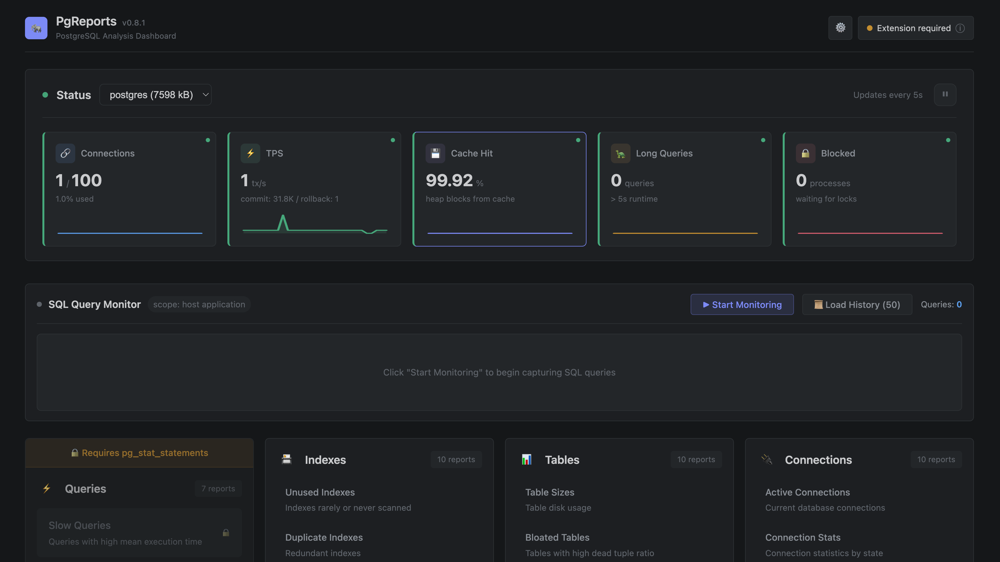

# PgReports

[](https://rubygems.org/gems/pg_reports)
[](https://www.ruby-lang.org/)
[](https://rubyonrails.org/)
[](https://opensource.org/licenses/MIT)

A comprehensive PostgreSQL monitoring and analysis library for Rails applications. Get insights into query performance, index usage, table statistics, connection health, and more — across **every database on the cluster**, switchable from the dashboard with no extra configuration. Includes a beautiful web dashboard, a Grafana / Prometheus exporter, and Telegram delivery.



## Features

- 🗄️ **Multi-database** - Auto-discovers every database on the cluster and lets you switch from a dropdown in the dashboard. No configuration required.
- 📊 **Query Analysis** - Identify slow, heavy, and expensive queries using `pg_stat_statements`
- 📇 **Index Analysis** - Find unused, duplicate, invalid, and missing indexes
- 📋 **Table Statistics** - Monitor table sizes, bloat, vacuum needs, and cache hit ratios
- 🔌 **Connection Monitoring** - Track active connections, locks, and blocking queries
- 🖥️ **System Overview** - Database sizes, PostgreSQL settings, installed extensions
- 🌐 **Web Dashboard** - Beautiful dark-themed UI with sortable tables and expandable rows
- 📨 **Telegram Integration** - Send reports directly to Telegram
- 📈 **Grafana / Prometheus Exporter** - Expose selected reports at `/metrics` with severity derived from configured thresholds
- 📥 **Export** - Download reports in TXT, CSV, or JSON format
- 🔗 **IDE Integration** - Open source locations in VS Code, Cursor, RubyMine, or IntelliJ (with WSL support)
- 📌 **Comparison Mode** - Save records to compare before/after optimization
- 📊 **EXPLAIN ANALYZE** - Advanced query plan analyzer with problem detection and recommendations
- 🔍 **SQL Query Monitoring** - Real-time monitoring of all executed SQL queries with source location tracking
- 🔌 **Connection Pool Analytics** - Monitor pool usage, wait times, saturation warnings, and connection churn
- 🤖 **AI Prompt Export** - Copy a ready-to-paste prompt for Claude Code, Cursor, or Codex with problem context and report data
- 🗑️ **Migration Generator** - Generate Rails migrations to drop unused indexes

## Installation

```ruby
# Gemfile
gem "pg_reports"
gem "telegram-bot-ruby"  # optional, for Telegram delivery
```

```bash
bundle install
```

Mount the dashboard:

```ruby
# config/routes.rb
Rails.application.routes.draw do
  if Rails.env.development?
    mount PgReports::Engine, at: "/pg_reports"
  end

  # Or with authentication:
  # authenticate :user, ->(u) { u.admin? } do
  #   mount PgReports::Engine, at: "/pg_reports"
  # end
end
```

Visit `http://localhost:3000/pg_reports`.

For query analysis, also enable `pg_stat_statements` — see [setup instructions in docs/configuration.md](docs/configuration.md#pg_stat_statements-setup).

## Usage

```ruby
# In console or code
PgReports.slow_queries.display
PgReports.unused_indexes.each { |row| puts row["index_name"] }

# Export
report = PgReports.expensive_queries
report.to_text
report.to_csv
report.to_a

# Telegram
PgReports.slow_queries.send_to_telegram
```

**[Full list of reports →](docs/reports.md)**

## Multi-database

The dashboard auto-discovers every database on the cluster you're connected to and shows a dropdown next to the *Status* panel. Switching is zero-config — credentials and host come from your existing `database.yml`. Schema-analysis reports stay scoped to the primary database (they introspect the host app's models); the dropdown greys them out elsewhere.

Programmatic access:

```ruby
PgReports.with_database("logs")    { PgReports.table_sizes }
PgReports.with_target(:analytics)  { PgReports.slow_queries }
```

For multi-cluster setups (separate analytics warehouse, replica with different credentials, etc.), register additional targets explicitly. **[Multi-database reference in docs/configuration.md →](docs/configuration.md#multi-database-support)**

## Configuration

PgReports works out of the box once mounted. Common options:

```ruby
# config/initializers/pg_reports.rb
PgReports.configure do |config|
  config.telegram_bot_token           = ENV["PG_REPORTS_TELEGRAM_TOKEN"]
  config.telegram_chat_id             = ENV["PG_REPORTS_TELEGRAM_CHAT_ID"]
  config.slow_query_threshold_ms      = 100
  config.unused_index_threshold_scans = 50
  config.bloat_threshold_percent      = 20

  # Strongly recommended in production
  config.dashboard_auth = -> {
    authenticate_or_request_with_http_basic do |user, pass|
      user == ENV["PG_REPORTS_USER"] && pass == ENV["PG_REPORTS_PASSWORD"]
    end
  }
end
```

**Multi-database, thresholds, query monitor, Grafana, raw query execution, source tracking, locale, Telegram —**
**[full reference in docs/configuration.md →](docs/configuration.md)**

## Report object

Every method returns a `PgReports::Report`:

```ruby
report = PgReports.slow_queries

report.title         # "Slow Queries (mean time >= 100ms)"
report.data          # Array of hashes
report.columns       # Column names
report.size          # Row count
report.empty?        # Boolean
report.generated_at  # Timestamp

# Output formats
report.to_text       # Plain text table
report.to_markdown   # Markdown table
report.to_html       # HTML table
report.to_csv        # CSV
report.to_a          # Raw data

# Actions
report.display                  # Print to STDOUT
report.send_to_telegram         # Send as message
report.send_to_telegram_as_file # Send as file attachment

# Enumerable
report.each { |row| puts row }
report.map { |row| row["query"] }
report.select { |row| row["calls"] > 100 }
```

## Dashboard features

The dashboard provides one-click execution, sortable columns, expandable rows, filter parameters, multi-format export, Telegram delivery, and pg_stat_statements management.

<details>
<summary><strong>EXPLAIN ANALYZE — query plan analyzer</strong></summary>

Expand a row with a query, click **📊 EXPLAIN ANALYZE**. Shows:

- **Status indicator** (🟢🟡🔴) — overall query health
- **Key metrics** — planning/execution time, cost, rows
- **Detected problems** — sequential scans on large tables, high-cost ops, sorts spilling to disk, slow sorts (>1s), inaccurate row estimates (>10× off), slow execution
- **Recommendations** for each issue
- **Color-coded plan** — node types tinted by performance impact (green: efficient, blue: normal, yellow: potential issue)
- **Line annotations** highlighting problems on specific plan lines

Queries from `pg_stat_statements` with parameter placeholders (`$1`, `$2`) prompt for parameter values before analysis.

Requires `config.allow_raw_query_execution = true`.

</details>

<details>
<summary><strong>SQL Query Monitor — real-time query capture</strong></summary>

Live capture of all SQL executed by your Rails app. Click **▶ Start Monitoring**, run any operation, watch the queries appear with:

- SQL with syntax highlighting
- Duration (color-coded: 🟢 <10ms, 🟡 <100ms, 🔴 >100ms)
- Source location with click-to-IDE
- Timestamp

Built on `ActiveSupport::Notifications` (`sql.active_record`). Filters internal queries (SCHEMA / CACHE / pg_reports' own). Logged to `log/pg_reports.log` (JSON Lines). Configurable buffer size and backtrace filter:

```ruby
PgReports.configure do |config|
  config.query_monitor_log_file = Rails.root.join("log", "custom_monitor.log")
  config.query_monitor_max_queries = 200
  config.query_monitor_backtrace_filter = ->(loc) { !loc.path.match?(%r{/(gems|ruby|railties)/}) }
end
```

Use cases: debugging N+1, identifying slow queries during feature development, tracking down unexpected queries, teaching ActiveRecord behavior.

</details>

<details>
<summary><strong>Connection pool analytics</strong></summary>

Four specialized reports under the **Connections** category:

- **Pool Usage** — total/active/idle per database, utilization %, idle-in-transaction count, available capacity
- **Wait Times** — queries waiting on locks/IO/network with wait event types and severity
- **Pool Saturation** — auto-classified (Normal / Elevated / Warning / Critical) with context-aware recommendations
- **Connection Churn** — age distribution by application, short-lived (<10s) detection, churn-rate calculation, missing-pooling diagnosis

```ruby
PgReports.pool_usage.display
PgReports.pool_saturation.display
PgReports.connection_churn.display
```

</details>

<details>
<summary><strong>IDE integration & migration generator</strong></summary>

Click any source location (file:line) in a report to open it in your IDE. Supported: VS Code, VS Code (WSL), RubyMine, IntelliJ IDEA, Cursor, Cursor (WSL). Use the ⚙️ button to set your default and skip the menu.

For unused or invalid indexes, the dashboard generates a Rails migration: expand the row → **🗑️ Generate Migration** → copy the code or create the file directly (opens in your default IDE).

</details>

<details>
<summary><strong>Save records for comparison</strong></summary>

When optimizing queries, click **📌 Save for Comparison** on any expanded row. Saved records persist in browser localStorage per report type and appear above the results table for before/after comparison.

</details>

<details>
<summary><strong>AI prompt export</strong></summary>

The Export dropdown includes **Copy Prompt** (visible on actionable reports). It assembles a ready-to-paste prompt with problem description, fix instructions, and the actual report data — formatted for Claude Code, Cursor, Codex, or any code-aware AI assistant.

</details>

<details>
<summary><strong>Grafana / Prometheus exporter</strong></summary>

Expose selected reports at `<mount_point>/metrics` in Prometheus exposition format. The default mount is `/pg_reports`, so the endpoint is typically `/pg_reports/metrics` — but it follows whatever path you used in `mount PgReports::Engine, at: "..."`. Severity (`ok` / `warning` / `critical`) is derived automatically from the thresholds defined in [`Dashboard::ReportsRegistry::REPORT_CONFIG`](lib/pg_reports/dashboard/reports_registry.rb).

```ruby
PgReports.configure do |config|
  config.grafana_favorites = [
    :slow_queries,
    :unused_indexes,
    :bloated_tables,
    :missing_validations,
    :polymorphic_without_index
  ]
  config.grafana_metrics_token = ENV["PG_REPORTS_METRICS_TOKEN"]  # optional bearer token
  config.grafana_cache_ttl     = 60                                # seconds
end
```

Scrape with Prometheus:

```yaml
scrape_configs:
  - job_name: pg_reports
    metrics_path: /pg_reports/metrics    # adjust to your Engine mount point
    scrape_interval: 60s
    authorization: { credentials: "${PG_REPORTS_METRICS_TOKEN}" }
    static_configs:
      - targets: ["app.internal:3000"]
```

> [!WARNING]
> Reports are cached via `Rails.cache` for `grafana_cache_ttl` so frequent scrapes don't hammer the database. Without it, Prometheus' default 15s scrape interval against heavy reports like `missing_validations` will DDoS your own DB. Always set a TTL ≥ scrape interval, and consider a longer per-report TTL for expensive reports.

The exporter also emits a `pg_reports_row` series per report row (each column becomes a Prometheus label), so the auto-generated dashboard can show a **table panel** with the actual rows that need fixing — not just an aggregate count.

Generate a matching Grafana dashboard from the same favorites:

```bash
bundle exec rake pg_reports:grafana:dashboard
# writes pg_reports.json in pwd; then Dashboards → Import in Grafana
```

**[Full Grafana integration guide →](docs/grafana.md)** &nbsp;·&nbsp; **[Local Prometheus + Grafana without Docker →](docs/grafana-local-setup.md)**

</details>

<details>
<summary><strong>Telegram delivery</strong></summary>

Get a bot token from [@BotFather](https://t.me/BotFather) and your chat ID from [@userinfobot](https://t.me/userinfobot), then:

```ruby
PgReports.configure do |config|
  config.telegram_bot_token = "123456:ABC-DEF..."
  config.telegram_chat_id   = "-1001234567890"
end

PgReports.slow_queries.send_to_telegram
PgReports.health_report.send_to_telegram_as_file
```

Reports under ~50 rows go as a message; larger ones are sent as a file attachment.

</details>

## Development

```bash
git clone https://github.com/yourusername/pg_reports
cd pg_reports
bundle install
bundle exec rspec
bundle exec rubocop
```

## Contributing

1. Fork it
2. Create your feature branch (`git checkout -b feature/my-feature`)
3. Commit your changes
4. Push to the branch
5. Create a Pull Request

## License

The gem is available as open source under the terms of the [MIT License](https://opensource.org/licenses/MIT).

## Acknowledgments

Inspired by [rails-pg-extras](https://github.com/pawurb/rails-pg-extras) and built with ❤️ for the Rails community.
